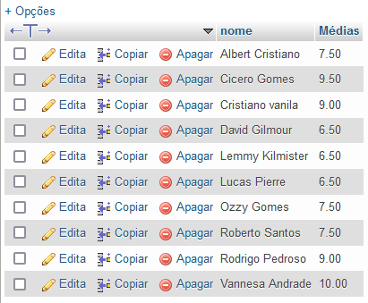
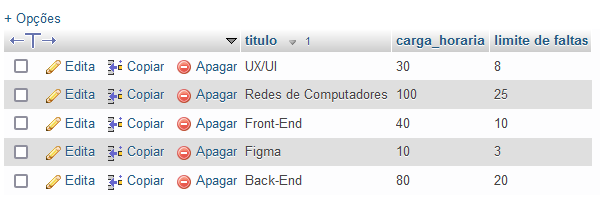
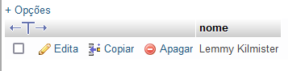
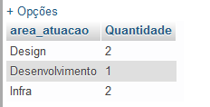
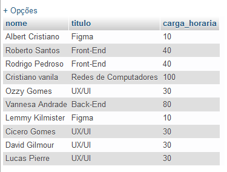
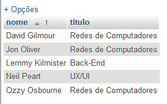
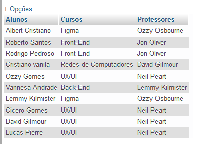
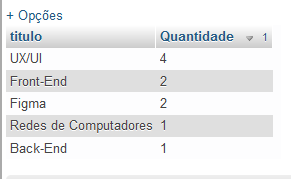
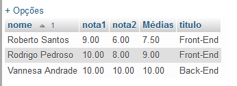

Craindo tabela de dados

<!-- Criando tabelas -->
```sql
CREATE TABLE cursos (
    id INT NOT NULL AUTO_INCREMENT,
    titulo VARCHAR(30) NOT NULL,
    carga_horaria TINYINT NOT NULL,
    PRIMARY KEY (id)
);
```	

```sql	
CREATE TABLE professores (
    id INT NOT NULL PRIMARY KEY AUTO_INCREMENT,
    nome VARCHAR(50) NOT NULL,
    area_atuacao ENUM('Design', 'Desenvolvimento', 'Infra') NOT NULL,
    curso_id INT NOT NULL
);
```

```sql
CREATE TABLE alunos (
    id INT NOT NULL PRIMARY KEY AUTO_INCREMENT,
    nome VARCHAR(50) NOT NULL,
    data_nascimento DATE NOT NULL,
    nota1 DECIMAL(4,2) NOT NULL,
    nota2 DECIMAL(4,2) NOT NULL,
    curso_id INT NOT NULL
);
```	

<!-- Realizando cadastro -->

    #### Cadastrando cursos

    ```sql
    INSERT INTO cursos (titulo, carga_horaria, professor_id)
    VALUES ('Front-End', 40, 1, NULL);
           ('Back-End', 80, 2, NULL);
           ('UX/UI', 30, 3, NULL);
           ('Figma', 10, 4, NULL);
           ('Redes de Computadores', 100, 5, NULL);
    ```

        ```sql
    INSERT INTO cursos (titulo, carga_horaria) VALUES 
    ('Front-End', 40, 1),
    ('Back-End', 80, 2),
    ('UX/UI', 30, 3),
    ('Figma', 10, 4),
    ('Redes de Computadores', 100, 5);
    ```

    INSERT INTO cursos (titulo, carga_horaria) VALUES ('Front-End', 40),('Back-End', 80),('UX/UI', 30),('Figma', 10),('Redes de Computadores', 100);

    
    INSERT INTO cursos (nome, area_atuacao, curso_id) VALUES 
    ('Jon Oliver', "Infra", 25),
    ('Lemmy Kilmister', "Desenvolvimento", 22),
    ('Neil Peart', "Design", 23),
    ('Ozzy Osbourne', "Design", 24),
    ('David Gilmour', "Infra", 25);
    ```


    INSERT INTO cursos (nome, data_nascimento, nota1, nota2, curso_id) VALUES 
    ('Albert', "1992-02-06", 8, 7, 25),
    ('Lemmy Kilmister', "Desenvolvimento", 22),
    ('Neil Peart', "Design", 23),
    ('Ozzy Osbourne', "Design", 24),
    ('David Gilmour', "Infra", 25);


   
    -- Criando comando de consulta

-- alunos e nascimento antes 2009
1) Faça uma consulta que mostre os alunos que nasceram antes do ano 2009
    ```sql
    SELECT * FROM alunos WHERE data_nascimento < '2009-01-01';
    ```
    


2) Faça uma consulta que calcule a média das notas de cada aluno e as mostre com duas casas decimais.
    ```sql
    SELECT nome, ROUND(AVG(nota1 + nota2)/2, 2) AS "Médias" FROM alunos GROUP BY nome;
    ```
    

3) Faça uma consulta que calcule o limite de faltas de cada curso de acordo com a carga horária. Considere o limite como 25% da carga horária. Classifique em ordem crescente pelo título do curso.
```sql	
    SELECT titulo, carga_horaria, ROUND(carga_horaria * 0.25) AS "limite de faltas" FROM cursos ORDER BY titulo DESC;
```	
    


4) Faça uma consulta que mostre os nomes somente dos professores da área de desenvolvimento.
```sql	
    SELECT nome FROM professores WHERE area_atuacao ="Desenvolvimento";
```	
    

5) Faça uma consulta que mostre a quantidade de professores por área de desenvolvimento.
```sql	
    SELECT area_atuacao, COUNT(*) AS "Quantidade" FROM professores GROUP BY area_atuacao;
```	
    

6) Faça uma consulta que mostre o nome dos alunos, o título e a carga horária dos cursos que fazem.
```sql
    SELECT alunos.nome, cursos.titulo, cursos.carga_horaria FROM alunos INNER JOIN cursos ON alunos.curso_id = cursos.id;
```	
    

7) Faça uma consulta que mostre o nome dos professores e o título do curso que lecionam. Classifique pelo nome do professor.
```sql
    SELECT professores.nome, cursos.titulo FROM professores INNER JOIN cursos ON professores.curso_id = cursos.id ORDER BY professores.nome;
```	
    

8) Faça uma consulta que mostre o nome dos alunos, o título dos cursos que fazem, e o professor de cada curso.
```sql	
    SELECT alunos.nome AS "Alunos", cursos.titulo AS "Cursos", professores.nome AS "Professores" FROM alunos INNER JOIN cursos ON alunos.curso_id = cursos.id INNER JOIN professores ON cursos.professor_id = professores.id;
```	
    


9) Faça uma consulta que mostre a quantidade de alunos que cada curso possui. Classifique os resultados em ordem descrecente de acordo com a quantidade de alunos.
```sql
    SELECT cursos.titulo, COUNT(*) AS "Quantidade" FROM alunos INNER JOIN cursos ON alunos.curso_id = cursos.id GROUP BY cursos.titulo ORDER BY Quantidade DESC;
```	
    

10) Faça uma consulta que mostre o nome dos alunos, suas notas, médias, e o título dos cursos que fazem. Devem ser considerados somente os alunos de Front-End e Back-End. Mostre classificados pelo nome do aluno.
```sql	
    SELECT alunos.nome, alunos.nota1, alunos.nota2, ROUND(AVG(alunos.nota1 + alunos.nota2)/2, 2) AS "Médias", cursos.titulo FROM alunos INNER JOIN cursos ON alunos.curso_id = cursos.id WHERE cursos.titulo = "Front-End" OR cursos.titulo = "Back-End" GROUP BY alunos.nome ORDER BY alunos.nome;
```	

    

11) Faça uma consulta que altere o nome do curso de Figma para Adobe XD e sua carga horária de 10 para 15.
    
    ```sql
    UPDATE cursos SET carga_horaria = 15 WHERE titulo = "Adobe XD";
    ```